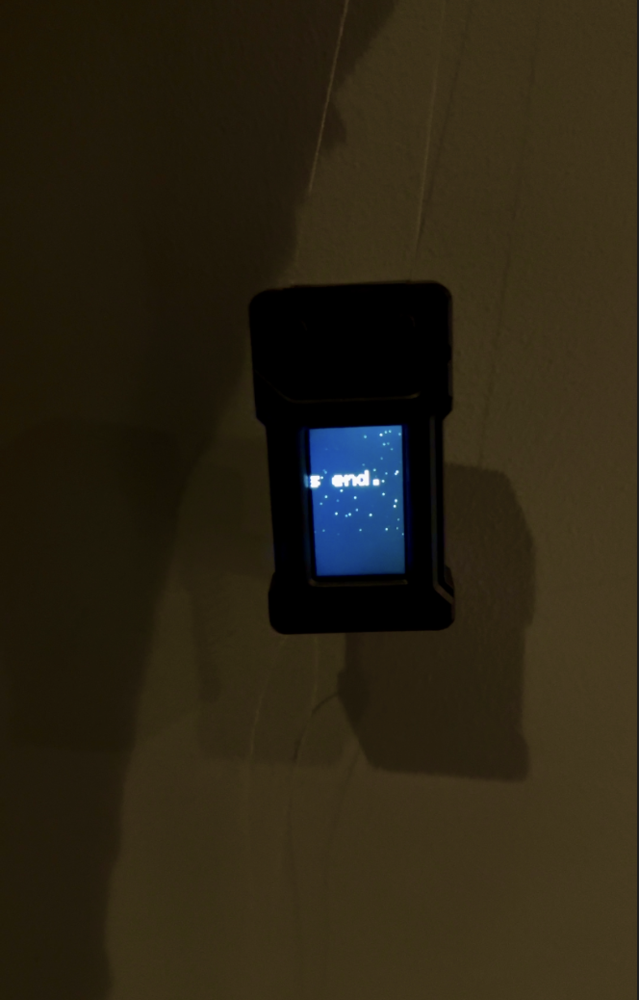

# esp32-Art-Installation

This project is a generative art installation that includes aspects such as a random visual and textual combinations. It displays a disapprearing city over 100 randomly placed star and a quote. 

# Initial State
On power up the system begins with a fully visible city skyline beneath a static night sky. The quote begins off screen establishing a sense of movement toward something that has not yet arrived.

# Generative Atmosphere
The stars are initialized using randomness so each run produces a unique night sky. Their brightness oscillates using sine waves creating an organic twinkling effect rather than mechanical blinking.

# Text Motion
The quote scrolls horizontally across the screen in a continuous loop. This introduces narrative progression inside an otherwise still landscape.

# City Transformation
The skyline slowly fades in and out using an oscillating alpha value. This creates a breathing effect where the city appears and disappears over time.

# Emotional Loop
As the quote moves forward the city fades away then returns. This cyclical transformation reflects transition rather than disappearance.

# Materials
- LILYGO T-Display ESP32 (TTGO T1): The primary microcontroller and display unit.
- 3.7V 150 mAh 0.6 Wh LP401730 Battery: Powers the device for portable use.
- USB-C Cable/Charger: Used for programming the chip and charging the battery.

# Software & Tools Required
- VS Code with the PlatformIO extension.
- Arduino Framework for ESP32.
- TFT_eSPI Library

#Reproducibility Instructions
- Clone the repository: git clone https://github.com/[your-username]/esp21-Art-Installation.git
- Open in VS Code: Launch VS Code and open the project folder. Ensure the PlatformIO extension is active.
- Library Configuration: The project uses TFT_eSPI. The platformio.ini is already configured to include the correct setup for the LILYGO T-Display via build flags:
build_flags =
  -D USER_SETUP_LOADED=1 
  -include $PROJECT_LIBDEPS_DIR/$PIOENV/TFT_eSPI/User_Setups/Setup25_TTGO_T_Display.h
- Build and Upload: Connect your LILYGO T-Display via USB-C and use the PlatformIO "Upload" button to compile and flash the firmware.
# Installation / Assembly Instructions
Plug the 3.7V LP401730 battery into the JST connector on the back of the LILYGO T-Display. The device will power on as soon as the battery is connected or when plugged into a USB-C power source.

P.S. To charge the battery, simply connect the device to a USB-C charger.
# Usage Instructions
Once powered, the screen will display the art piece.

# Photos

